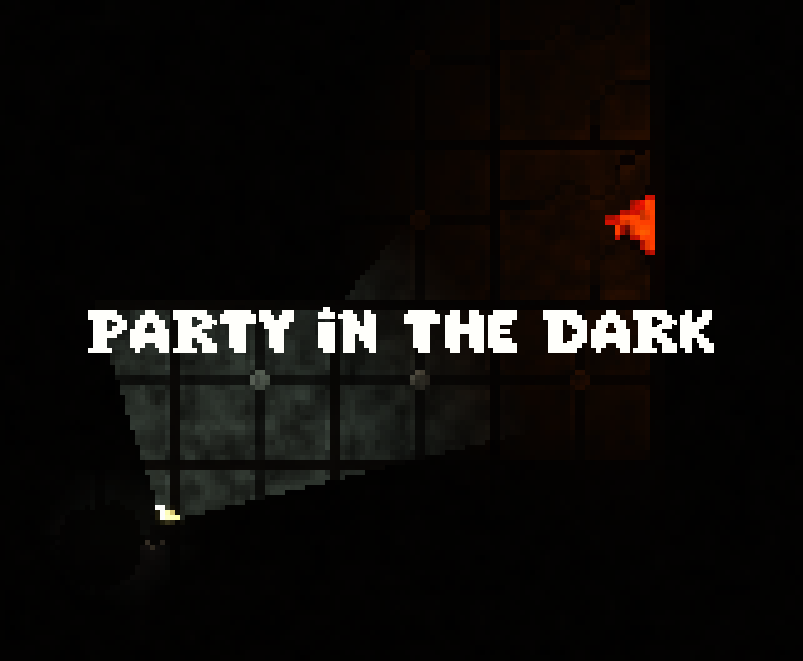

# Party In The Dark



## Overview

"Party In The Dark" is a tense, immersive adventure where you explore a dark maze with only a flashlight to guide you. Avoid monsters, dodge traps, and collect hidden rewards along the way. But be prepared—something unexpected awaits at the end of your journey! Can you survive the maze and uncover its secrets?

## Media

### Gameplay


### Screenshots


## Development

- The game is developed using Unity and C#
- Features custom shaders, 30+ original sprites, 4 original music tracks, and more

During the development, I had the opportunity to dive into several new areas of game development. Here are some of the key things I learned:

- 2D Shaders: I created custom shaders to enhance the game's visual effects and atmosphere.
- 2D Lighting: I implemented 2D lighting to set the mood, casting shadows and highlighting key elements in the maze.
- Making Cutscenes: I used Unity’s Timeline and Cinemachine to create dynamic cutscenes that added narrative depth to the game.

# Installation

1. Clone the repository to your local machine:

   ```shell
   git clone https://github.com/andrewkorzh0/PartyInTheDark.git
   ```

2. Open the project in Unity (make sure you're using the correct Unity version as specified in the project).

3. Once loaded, click "Play" to start the game in the Unity editor or build it for your desired platform.

# spin spin spin


